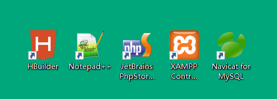
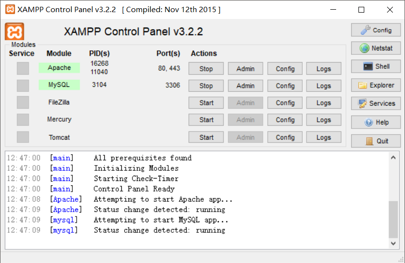
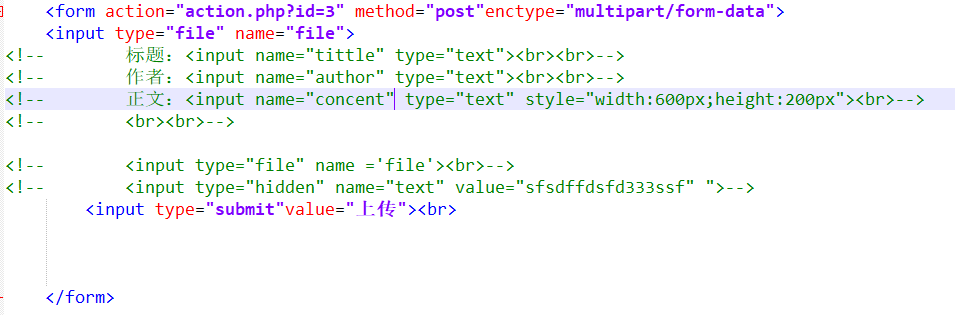
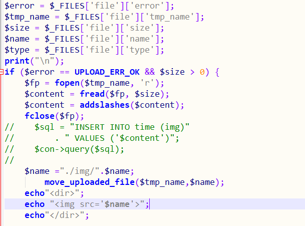
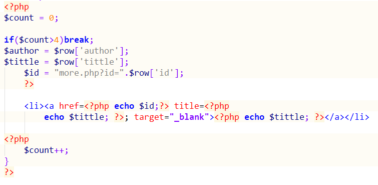
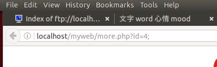
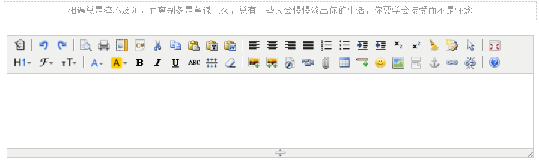
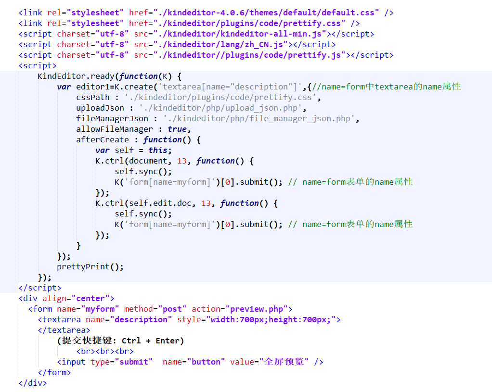
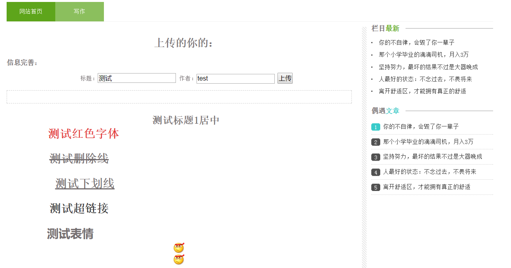

# 网页的设计

------


> 这个Demo是在windos搭建并且进行测试，将测试完成的网页直接移到Linux的/var/www/html/文件夹下，所以先进行Windows下的服务器环境进行搭建，用于调试网页，下面是用到的几款软件。

​          

 Windows环境下的环境搭建我使用的是Xampp，集成了Apache+Mysql等多种服务于一体(这里选用了继承了php5.6的Xampp)，与Linux下的Apache2类似，他的默认localhost目录是Xampp安装目录下的htdocs文件夹。

​	

> 这里的网页编辑使用了以上的编辑工具，Notepad++、PhpStorm、Hbuilder，Dreamweaver不支持php的语法补齐和代码预览直接放弃。
>```
> 1. Hbuilder 用于修改界面
> 2. Phpstorm 用来编写逻辑代码
> 3. Notepead++ 用来修改文件编码字符集
> ```
> 一开始就想找个网站参考参考，本来想自己写个简单的页面，看了半天实在是头大，于是找现成的网页，然后还真找了一个现成的(如图8所示)。

 

>​	将这个网站的文章模块的标题、作者、时间、内容，分别作为4个字段，再加上主键id将他们储存到数据库中，主键自增且不会重复。新建了test.php对数据库进行操作测试，最先想实现的是将图片作为封面上传到Mysql，然后从Mysql读取到网页，首先是实现将图片上传并显示在网页上，它是通过Php的一个网页提交表单，这里\<form>标签使用POST的请求方式提交表单，enctype="multipart/form-data"将文件以二进制的方式进行上传。

 

>​在action跳转指向的php中，使用$_FILE[’file’]进行接收，if判断是否接收成功，并使用move_upload_file()方法将文件加载到缓存，使用php的echo语句将图片打印到网页上(如图10所示)。



> 图片上传网页实现的倒是很简单，然后使用Navicat for MySQL新建writer数据库建一张表，使用BlOB格式进行保存图片测试，存入数据库也没有什么问题，在Navicat for MySQL中也能查看到图片，可是再取出的时候却乱码了，最后就放弃了图片的出妇女。只对进行对text、int类型的存取，这候发现同样也乱码了，查了很多的资料发现时编码没有完全统一的问题。
>
> 数据库和和表的类型必须一致，只要是字符类型都得指定编码类型，Linux下默认的都是utf-8，所以推荐把所有的类型都设置为utf-8来确保不会出现乱码。需要指定编码类型的位置有：

```
1. 数据库指定字符集为utf8 -- UTF-8 Unicode，排序规则为utf8_general_ci

2. 表的字符集为utf8，排序规则为utf8_general_ci

3. Html文件meta指定为 \<meta charset="utf-8">

4. Php设置 header('content-type:text/html;charset=utf8');

5. 数据库连接设定字符集 $con->query("SET NAMES'UTF8'");
```

>至此，全部解决了中文的乱码问题，然而当从数据库调用图片的时候依旧乱码无法解决问题，不管设置HTML显示格式还是什么，最终把图片的数据库使用放弃了以后再说。另外碰到的一个问题就是php版本的问题，因为php7是不同于php5的，在php7中将php5中的MySQL语句已经废除，所以在php7的Apache服务器上不能使用有MySQL的语句，类似于MySQL_concent(“”)都将会出错无法运行，所以这里的Xampp选择的是php5.6的版本。

					

>  因为网页文章的显示格式都是相同的，所以使用php对数据库的遍历中循环HTML标签，echo可以打印HTML标签，但是打印带有(“)的需要加入(\)进行转义，但是HTML标签会掺有很多的(“)，所以这样会使语句变得非常复杂，将一个php标签拆分，即两个标签完成一个php的循环语句，。在插入的HTML文件中使用php的变量需要使用php的标签进行echo:<?phpecho ‘\$row’;？>打印变量信息，用这个方法拆分php的while()语句，加入结束判断语句if($count>5)bread;跳出while()循环进而结束循环，实现网页多条相似语句的打印。
>
>  另外的重点就是在php页面之间进行信息传输，具体的方法就是类似前面的上传图片语法，另一端的php文件使用$_PSOT或者$_GET方式来进行接收数据，两种请求方式的区别就是get方式传递的信息会在url的尾部进行显示(如图12所示)，所以get方式也可以直接将需要传递的信息以”?id=$id”加在url后面直接进行访问，而post方式则不会显示在地址栏，为lcoalhost/myweb/more.php。



>  网站的主页通过每条栏目的查看更多，使用get方式将对应的一条数据的id传递给接收界面，这样接收页面得到了id就可以再次连接数据库并且从里面获取到这条指定的数据，并把它打印在网页上，把这种从操作引用在所有的网页跳转上。
>
>  到了周四的中午已经实现了所有的浏览功能，从数据库进行修改就可以进行增删改，并且将他们同步到网页上来，页面上的超链接都可用。一开始就想加入一个上传的功能，可是又觉得直接用<input>来实现实在是难看太low，所以又不想加又看到了在线的HTML编辑器，就想也加到自己的网页之上，机缘巧合找到了这个叫做kindeditor的富文本编辑器开源项目，这个编辑器直接是好用到哭啊，功能超级强大(如图13所示)。 



>  虽然一开始仅仅想把文本内容保存下来，但是发现这个编辑器能直接从编辑器中获取到文本的HTML代码，这样这里面的段落格式，加上颜色、字体、大小、超链接、甚至还有小表情url图片都可以保存上去，进而又勾起了我的野心：数据库保存HTML代码！页面输出格式！
>
>  说干就干，现将开源项目下载下来解压到网页文件夹中，然后将js/css使用link和script引入，文件位置就是下载的文件对应路径(具体代码如图14所示)，action=‘’指向的对象中使用\$_REQUEST[‘description’]来接收HTML代码，使用echo \$concent;就可以直接将所有格式输出到页面上。




>​将获得的HTML代码通过POST方式传递给peview.php，将获得的HTML直接使用php的echo打印在页面，并且可以看到格式的保存效果(如图15所示)。在这个页面加入两个input输入框用来完善信息，用\<input type=’hidden’value=’\$html_concent’>(这样可以在页面上隐藏并且能够保存HTML代码到表单)来保存\$html_concent =$_REQUEST[‘description’’]方便上传，点击上传会提交表单以POST请求，将HTML代码以及作者、标题传递给tip.hph，并在这里将所用的信息进行保存，并在页面给出上传是否成功的提示。



>​将HTML代码存入数据库的时候碰到了点问题，带有\<HTML>标签的文本，只能保存第一个(<)到第一个空格之间的内容，也就是一大段有格式的文字只会保存为’<h’(实际HTML代码为’<h实例文字\</h>’)， 开始以为是sql插入语句出了问题，可是修改也并没有达成效果，于是将\<input type=’hidden’>的type改为显式的text，发现这里的值就是’<h’,并不是数据库储存时出错，而是将值保存到input的时候没有保存完整，出错的代码是input type="hidden"name="concent" value=<?php echo \$html_concent;?>;>,输入框中也只显示了’<h’，错就错在value的赋值上，解决办法：改成 value='<?php echo $html_concent;?>';就解决了问题。


## 出现的问题及解决方案

---

    1. PHP7.2不兼容mysql()的方法，无法连接MySQL

 > 使用mysqli()或者更换为PHP5.6

    3. PHP 循环打印相同格式带有的HTML代码

 > 将php代码拆分到两个<?php?>标签中去，将HTML语句放在两个标签中间

    5. PHP echo打印HTML与已存冲突，排版错乱
> 没什么保留的好办法，可以使用strip_tags(str)去除HTML的<>标签只保留文本

    6. PHP截取字符串乱码
> 使用mb_substr(str,begin,length,"UTF8");

    MySQL存取中文，网页显示乱码

>```
> 1. 表的字符集为utf8，排序规则为utf8_general_ci
> 2. Html文件meta指定为 <meta charset="utf-8">
> 3. Php设置 header('content-type:text/html;charset=utf8');
> 4. 数据库连接设定字符集 $con->query("SET NAMES'UTF8'");
> 5. 数据库指定字符集为utf8 -- UTF-8 Unicode，排序规则为utf8_general_ci
>```

	MySQL保存图片乱码无法显示在网页(未解决)
